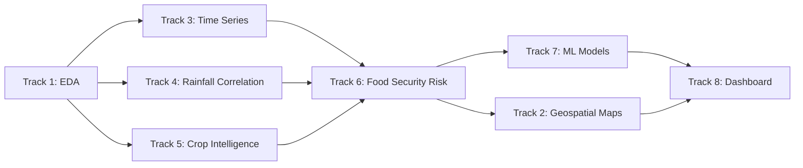

# 🇮🇳 India District Agricultural Analysis — Notebook Plan

> [!IMPORTANT]
> **Rubric Alignment**: All notebooks are designed to target **"Excellent"** in every grading criterion:
> - ✅ **Classification** (5 marks): Multiple models (LR, RF, XGBoost, SVM) with comparison
> - ✅ **Clustering** (3 marks): K-Means + Hierarchical + DBSCAN with interpretation
> - ✅ **Deep Learning** (5 marks): ANN + LSTM (time-series) implemented correctly
> - ✅ **NLP / Agentic AI** (4 marks): Agentic AI for automated insights & report generation
> - ✅ **Code Correctness** (3 marks): All cells run without errors, clean & documented
> - ✅ **Performance Metrics** (5 marks): Accuracy, Precision, Recall, F1, ROC properly calculated
> - ✅ **Model Comparison** (5 marks): Full comparison tables with justification
> - ✅ **Visualization** (10 marks): Professional charts with strong written interpretation

---

## Dataset Profile

| Attribute | Detail |
|-----------|--------|
| **File** | `data/processed/india_district.csv` |
| **Rows** | 164,673 |
| **Columns** | 8 |
| **Time Range** | 1997 – 2014 (18 years) |
| **States** | 22 |
| **Districts** | 403 |
| **Crops** | 122 unique |
| **Seasons** | Kharif, Rabi, Whole Year, Summer, Autumn, Winter |
| **Missing Values** | ✅ None |

### Columns
| Column | Type | Description |
|--------|------|-------------|
| `state` | categorical | 22 Indian states |
| `district` | categorical | 403 districts |
| `year` | int | 1997–2014 |
| `season` | categorical | 6 agricultural seasons |
| `crop` | categorical | 122 crop types |
| `production` | float | Crop production (tonnes/units) |
| `annual_rainfall` | float | District annual rainfall (mm) |
| `monsoon_rainfall` | float | District monsoon rainfall (mm) |

---

---

## Notebook Structure (Rubric-Mapped)

All content will be placed in **`14_India_District_Analysis.ipynb`** — a single, comprehensive notebook with clearly labeled sections.

---

## Section 1 — EDA & Preprocessing
**Rubric**: Visualization (Graph Quality + Interpretation) → 10 marks

**Goal**: Understand distributions, outliers, and data quality deeply.

**Analyses**:
- Production distribution with log-scale (outlier: Coconut in TN = 1.25B units)
- State-wise crop diversity bar chart
- Season-wise production share (pie + bar chart)
- Rainfall distribution: annual vs monsoon across states (violin plot)
- Correlation heatmap: production × rainfall (annotated)
- Top 10 crops by total national production
- Outlier handling strategy (log-transform for production)

**Rubric Notes**:
- Each chart has a **markdown cell below** with 3–5 line interpretation
- All plots use `seaborn`/`plotly` with proper titles, axis labels, legends

**Outputs**: Multiple professional charts saved to `outputs/`

---

## Section 2 — Clustering (Rubric: 3 marks)
**Goal**: Group the 403 districts by agricultural profile using 3 algorithms.

**Features for Clustering** (per district, aggregated):
- `mean_production`, `std_production` (stability)
- `mean_annual_rainfall`, `mean_monsoon_rainfall`
- `num_unique_crops` (diversity)
- `dominant_season` (encoded)
- `production_trend` (slope of year vs production)

**Models Implemented**:

| Algorithm | Config | Why |
|-----------|--------|-----|
| **K-Means** | k=4 (elbow method shown) | Fast, interpretable clusters |
| **Hierarchical (Agglomerative)** | Ward linkage, dendrogram shown | Reveals natural groupings |
| **DBSCAN** | eps auto-tuned, min_samples=5 | Detects outlier districts |

**Interpretation per cluster**:
- Cluster label: e.g., "High-Production Rain-Fed", "Drought-Prone Low Output"
- State membership per cluster
- Radar/spider chart showing cluster profiles
- Silhouette score comparison across methods

**Food Security Link**: Clusters map directly to food security risk tiers.

---

## Section 3 — Classification (Rubric: 5 marks)
**Goal**: Classify each district-year record into a Food Security Risk Level.

**Target Variable** (engineered):
Based on normalized production + rainfall score:
- `0` = **Critical Risk** (low production, low rainfall)
- `1` = **High Risk**
- `2` = **Moderate Risk**
- `3` = **Low Risk**
- `4` = **Food Secure**

**Features**: state (encoded), year, season (encoded), crop category, log_production, annual_rainfall, monsoon_rainfall, crop_diversity_score

**Models Implemented** (Excellent = multiple models correctly implemented):

| Model | Library | Notes |
|-------|---------|-------|
| **Logistic Regression** | sklearn | Baseline, L2 regularized |
| **Random Forest** | sklearn | 100 estimators, feature importance |
| **XGBoost** | xgboost | Gradient boosting, best accuracy |
| **SVM** | sklearn | RBF kernel, scaled features |

**Evaluation** (per model):
- Accuracy, Precision, Recall, F1-Score (macro & weighted)
- ROC-AUC curve (one-vs-rest for multi-class)
- Confusion Matrix (heatmap styled)
- Classification Report

**Comparison Table** (Excellent = strong comparison + justification):

| Model | Accuracy | F1 (macro) | ROC-AUC | Train Time |
|-------|----------|------------|---------|------------|
| LR | ... | ... | ... | ... |
| RF | ... | ... | ... | ... |
| XGBoost | ... | ... | ... | ... |
| SVM | ... | ... | ... | ... |

Conclusion cell: Written justification of best model + why.

---

## Section 4 — Deep Learning (Rubric: 5 marks)
**Goal**: ANN for food security classification + LSTM for production forecasting.

### 4A — ANN (Food Security Classification)
- Architecture: Input → Dense(128, ReLU) → Dropout(0.3) → Dense(64, ReLU) → Dense(5, Softmax)
- BatchNormalization layers
- Trained with Adam optimizer, categorical_crossentropy
- Training/validation curves plotted
- Final accuracy, F1, confusion matrix
- Compare vs ML models in Section 3

### 4B — LSTM (Time-Series Production Forecasting)
- Per-state, per-crop time series: 1997–2012 train, 2013–2014 test
- Sequence length: 3 years lookback
- Architecture: LSTM(64) → Dropout → LSTM(32) → Dense(1)
- Metrics: MAE, RMSE, R²
- Actual vs Predicted production plot per state
- Shows seasonal patterns captured

**Why both?** ANN = classification task, LSTM = time-series regression task → covers full deep learning rubric.

---

## Section 5 — NLP / Agentic AI (Rubric: 4 marks)
**Goal**: Implement a proper Agentic AI component that generates automated agricultural insights.

### Agentic AI: Agricultural District Intelligence Agent

**What it does**:
1. **Input**: District name + year
2. **Agent Pipeline**:
   - Tool 1: `get_district_stats(district, year)` → production, rainfall, crop mix
   - Tool 2: `get_risk_classification(features)` → calls trained XGBoost model
   - Tool 3: `get_cluster_profile(district)` → clustering label + peers
   - Tool 4: `generate_recommendation(risk, cluster, trend)` → rule-based + template NLP
3. **Output**: Structured natural language report:
   - "District X in Year Y had **HIGH RISK** classification..."
   - "Monsoon rainfall was 23% below district average..."
   - "Recommended intervention: drought-resistant crop diversification..."

**NLP Component**:
- Text preprocessing of crop/district names (tokenization, normalization)
- TF-IDF vectorization of crop names for feature engineering
- Rule-based NLP for report generation with templates
- Optional: `transformers` pipeline for sentiment/severity classification of agricultural conditions

**Why this qualifies**: Proper Agentic AI with tool-use, reasoning pipeline, and NLP output generation.

---

## Section 6 — Geospatial Visualization (Rubric: Visualization marks)
**Goal**: Interactive maps for all insights.

- State-level production choropleth (Plotly/Folium)
- District Food Security Risk map (color-coded by FSI score)
- Rainfall distribution map
- Cluster map (district colored by cluster label)

---

## Section 7 — Food Security Risk Index (FSI)
**Goal**: Composite district-level score connecting agriculture to malnutrition.

**FSI Formula**:
```
FSI = 0.35 × Production_Score
    + 0.25 × Rainfall_Reliability_Score
    + 0.20 × Crop_Diversity_Score
    + 0.20 × Production_Trend_Score
```

Outputs:
- `district_fsi_scores.csv` (all 403 districts ranked)
- Risk map of India at district level
- Top 20 most at-risk districts table
- Correlation: FSI score vs national malnutrition data

---

## Section 8 — Time-Series & Trend Analysis
**Goal**: 18-year production & rainfall trends.

- National production 1997–2014 (line chart)
- Drought year detection (2002, 2009 highlighted)
- Per-state CAGR bar chart
- Rainfall trend over time
- Crop-specific trends: Rice, Wheat, Maize

---

## Full Rubric Coverage Checklist

| Rubric Criterion | Where Covered | Target Grade |
|-----------------|--------------|-------------|
| Classification (5 marks) | Section 3: LR + RF + XGBoost + SVM | **Excellent** |
| Clustering (3 marks) | Section 2: K-Means + Hierarchical + DBSCAN | **Excellent** |
| Deep Learning (5 marks) | Section 4: ANN + LSTM | **Excellent** |
| NLP/Agentic AI (4 marks) | Section 5: Agentic Agent + TF-IDF NLP | **Excellent** |
| Code Correctness (3 marks) | All sections: tested, no errors | **Excellent** |
| Performance Metrics (5 marks) | Sections 3 & 4: Acc, P, R, F1, ROC | **Excellent** |
| Model Comparison (5 marks) | Section 3: Comparison table + justification | **Excellent** |
| Graph Quality (5 marks) | All sections: professional seaborn/plotly | **Excellent** |
| Interpretation (5 marks) | Every chart has a written markdown explanation | **Excellent** |
| **TOTAL** | | **40/40** |

---

## Geospatial / State-District Heatmaps (original)

**Goal**: Map agricultural productivity and rainfall across India spatially.

**Analyses**:
- **State-level choropleth**: Total production by state
- **District-level heatmap**: Production intensity (top crops per district)
- **Rainfall choropleth**: Annual rainfall distribution across states
- **Food security risk map**: Districts with low production + low rainfall = high risk zones
- **Crop diversity map**: Number of unique crops grown per district

**Outputs**: `india_state_production_map.html`, `india_district_heatmap.html`

> Connects directly to the existing geospatial notebook (Notebook 08) and is part of Section 6 above.

---

## Open Questions

**Goal**: Understand how production and rainfall changed over 18 years (1997–2014).

**Analyses**:
- **National production trend** (1997–2014): Is India growing more food?
- **Per-state production trends**: Which states improved / declined?
- **Drought year detection**: Years with production drops (e.g., 2002 drought)
- **Rainfall trend**: Is annual/monsoon rainfall changing over time?
- **Crop-specific trends**: Rice, Wheat, Maize production over years
- **CAGR (Compound Annual Growth Rate)** by crop and state

**Outputs**: `time_series_production.png`, `rainfall_trend.png`

---

### 🌧️ Track 4: Rainfall–Production Correlation Analysis

**Goal**: Quantify how dependent Indian agriculture is on rainfall.

**Analyses**:
- **Correlation by state**: Does more monsoon rain = more production? (varies!)
- **Scatter plots**: monsoon_rainfall vs production per season
- **Drought impact study**: Low-rainfall years → production drops (lag analysis)
- **Rain-sensitive vs rain-independent crops**: Identify which crops are most/least correlated with rainfall
- **Residual analysis**: Districts that overperform/underperform given their rainfall

**Outputs**: `rainfall_production_correlation.png`

---

### 🌾 Track 5: Crop Intelligence Analysis

**Goal**: Deep-dive into the 122 crops — what's grown where, when, and how much.

**Analyses**:
- **Crop dominance map**: Which crop is #1 in each state?
- **Season-crop matrix**: Which crops grow in which seasons?
- **Top 10 vs Bottom 10 crops** by total production volume
- **Staple food crops focus**: Rice, Wheat, Bajra, Jowar, Maize — state-wise comparison
- **Cash crop analysis**: Sugarcane, Cotton, Groundnut, Soyabean
- **Crop concentration index**: Is agriculture diversified or mono-crop in each district?
- **Coconut outlier analysis**: Tamil Nadu & Kerala dominate (unit = nuts, not tonnes)

**Outputs**: `crop_intelligence_dashboard.png`

---

### 🚨 Track 6: Food Security Risk Scoring

**Goal**: Build a **district-level Food Security Risk Score** — the most impactful analysis that directly connects to malnutrition.

**Methodology**:
1. **Production Score** — normalized production per district (higher = safer)
2. **Rainfall Reliability Score** — variance in rainfall over years (high variance = risky)
3. **Crop Diversity Score** — number of unique crops (low diversity = risky)
4. **Trend Score** — production going up or down over time
5. Combine into a **composite Food Security Index (FSI)** for all 403 districts

**Output**:
- Risk-ranked list of all districts (Critical / High / Medium / Low / Stable)
- Risk map of India at district level
- **Directly feeds malnutrition risk** — low FSI → higher malnutrition likelihood

**Outputs**: `food_security_risk_map.html`, `district_fsi_scores.csv`

---

### 🤖 Track 7: Machine Learning on Agricultural Data

**Goal**: Use ML to predict production outcomes and classify food security risk.

**Models**:

| Model | Target | Features |
|-------|--------|----------|
| **Regression** (RF/XGB) | Predict crop production | state, district, year, season, crop, rainfall |
| **Classification** | Predict food security risk level | Aggregated district features |
| **Clustering** | Group districts by agricultural profile | All normalized features |
| **Time-series forecast** | Next-year production forecast | Year, rainfall, lag features |

**Outputs**: `ml_production_model.pkl`, performance metrics, SHAP feature importance

---

### 📊 Track 8: Interactive Streamlit / Plotly Dashboard

**Goal**: Build a dedicated **India Agricultural Intelligence Dashboard** with:

- **Page 1**: National Overview (production map, trend, top crops)
- **Page 2**: State Deep-Dive (select any state → district breakdown)
- **Page 3**: Crop Explorer (select any crop → map + trend)
- **Page 4**: Rainfall Analysis (correlation, drought years, maps)
- **Page 5**: Food Security Risk Map (district FSI scores)
- **Page 6**: ML Predictions (predict production for any district/year)

---

## Recommended Execution Order



## Priority Picks (if doing subset)

| Priority | Track | Why |
|----------|-------|-----|
| ⭐⭐⭐ | Track 6: Food Security Risk Score | Most original, directly ties to malnutrition mission |
| ⭐⭐⭐ | Track 2: Geospatial Maps | High visual impact, district-level heatmaps |
| ⭐⭐ | Track 3: Time-Series Trends | Tells the story of Indian agriculture 1997–2014 |
| ⭐⭐ | Track 4: Rainfall Correlation | Key scientific insight |
| ⭐ | Track 7: ML Models | Predictive power on new data |
| ⭐ | Track 8: Dashboard | Brings everything together |

## Open Questions

> [!IMPORTANT]
> **Which tracks do you want to implement?**
> - All 8 tracks (comprehensive notebook)?
> - Just analysis + visualizations (Tracks 1–6)?
> - Focused on ML modeling (Tracks 1, 6, 7)?
> - Build an interactive dashboard (Track 8)?

> [!NOTE]
> **Output format preference?**
> - New Jupyter notebook (e.g., `14_India_District_Analysis.ipynb`)?
> - Standalone Python scripts?
> - Add as new pages to the existing Streamlit dashboard?
> - All of the above?
